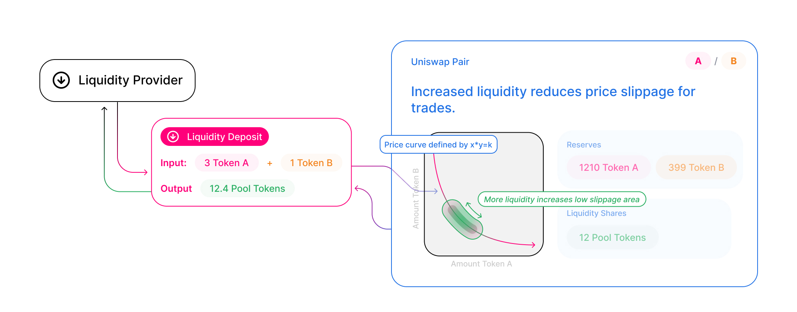
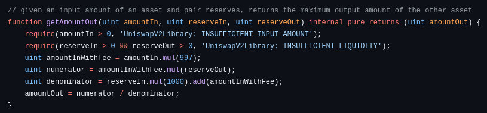

# Lab 5.

## 1. Repozytorium

https://github.com/Uniswap/v2-core/tree/master

## 2. Ile jest par?

https://etherscan.io/address/0x5C69bEe701ef814a2B6a3EDD4B1652CB9cc5aA6f#readContract

Czytam z `allPairsLength()`

Odp: `410655`

## 3. Kontrakt dokonujący wymiany

https://github.com/Uniswap/v2-core/blob/master/contracts/UniswapV2Pair.sol

Funkcja `swap`, linia `159`.

## 4. Audyt

https://1hive.org/audit.html#orgbd4e765

W zakładce `Findings` mamy 3 bugi i 7 sugestii.

## 5. Wyznaczanie ceny

Uniswap wyznacza cenę pary na podstawie niezmiennika `K` i swoich rezerw w obu walutach.

https://github.com/Uniswap/v2-periphery/blob/master/contracts/libraries/UniswapV2Library.sol

Ta funkcja w periphery pozwala obliczyć maksymalną liczbę tokenów którą możemy kupić:

Liczymy tak, aby `k` było niezmiennicze względem zmiany zmienionych rezerw bez prowizji, natomiast w praktyce, z powodu prowizji `k` lekko wzrośnie.

## 6. Mutex w smart kontrakcie

Zabezpiecza przed tak zwanym Reentrancy.

Atakujący może kilka razy wykonać `swap` po tej samej cenie.
Atakujący może stworzyć smart contract, który w funckji `fallback()`, która może być wywołana przez `swap` podczas transferu, jeszcze raz woła `swap` przed tym jak zaaktualizowane zostały rezerwy i dzięki temu może on wielokrotnie zamienić tokeny po tej samej cenie i "ukraść płynność".