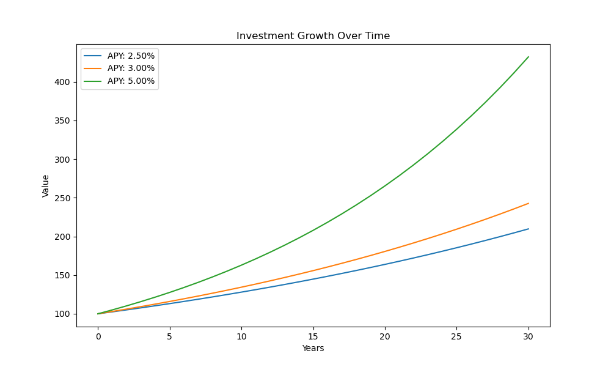

# Lab 6.

## 1. Lokalizacja kontraktu

https://github.com/compound-finance/compound-protocol/blob/master/contracts/CToken.sol

Główny kontrakt znajduje się w pliku `contracts/CToken.sol`, odpowiada on za obsługę pożyczek.

## 2. Cel protokołu

Compound jest zdecentralizowanym rynkiem pieniężnym (DeFi), pozwalającym użytkownikom na depozyt swoich kryptowalut, za co otrzymują `cTokens` i zarabiają odsetki, oraz na pożyczanie aktywów.

## 3. Gdzie liczy się stałą stopę procentową?

https://github.com/compound-finance/compound-protocol/blob/master/contracts/WhitePaperInterestRateModel.sol

Stałą stopę procentową liczy się w konstruktorze kontraktu implementującego `InterestRateModel`, np. w `WhitePaperInterestRateModel` dzieje się to w linii `36` i `37` i jest ona liczona na podstawie `baseRatePerBlock = baseRatePerYear / blockPerYear`. Jest to później używane do liczenia `getBorrowRate` do liczenia obecnej stopy na podstawie `baseRate`, `utilizationRate` i `multiplierPerBlock`.

## 4. Oddzielenie mechanizmu liczenia stopy procentowej

Mechanizm liczenia stopy procentowej jest oddzielony w ten sposób, że kontrakt `cToken` przyjmuje adres do odzielnego kontraktu implementującego `InterestRateModel`. Pomaga to wyabstrachowaniu liczenia stopy procentowej i w łatwiejszym zmienianiu lub aktualizowaniu tego mechanizmu, bez zmiany głównego kontraktu. Zmniejsza to też rozmiar głównego kontraktu, dzięki czemu łatwiej testować i formalnie weryfikować.

## 5. NonReentant

Modyfikator `nonReentrant` podobnie jak `lock` w Uniswapie ma zapobiegać atakom typu `reentrancy` jest on zaimplementowany na samym końcu pliku `contracts/CToken.sol` w linii `1150`.

## 6. Liczenie kursu

Kurs wymiany `exchangeRate` jest liczony w pliku `contracts/CToken.sol` w linii `293`. Opiera się na wzorze $exchangeRate = \frac{totalCash + totalBorrows - totalReserves}{cTokenSupply}$

## 7. Diagram wzrostu kapitału

https://compound.finance/documents/Compound.Whitepaper.pdf

W Whitepaperze mamy podaną base rate `2,5%` . Odsetki są naliczane przy każdym bloku. Historycznie dla np stablecoinów `APY` wynosiło ok `3-5%` rocznie.
Wykres wartość zainwestowanego kapitału na przestrzeni lat w zależności od stopy procentowej.

